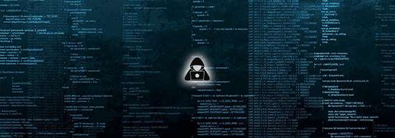

<h1>Lucas Anjos</h1>

Um apaixonado por tecnologia

 

<h4>Sobre mim</h4>
 
:computer: Desenvolvedor e Pentester
 
:bulb: Curioso e sempre procuro entender o motivo das coisas
 
:coffee: Eu costumo estudar cada vez mais sobre programação e segurança da informação. São duas áreas fascinantes, a primeira por te dar o poder de construir qualquer coisa que vier à cabeça, a segunda pelo simples fato da informação ser o maior bem que o ser humano pode ter.
 

 

<h4>Acredito que a Lealdade seja a coisa mais importante entre as relações interpessoais</h4>

 

  

Keep Coding!

